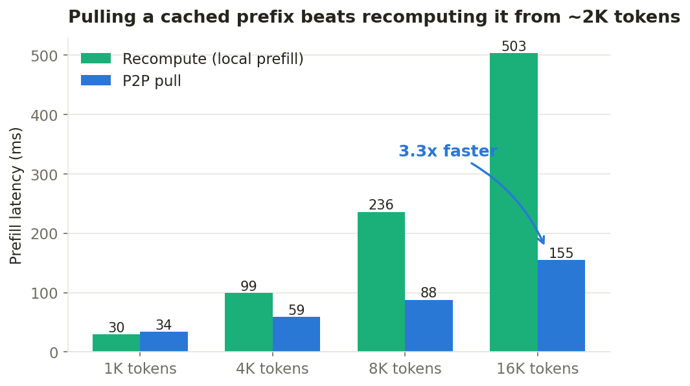
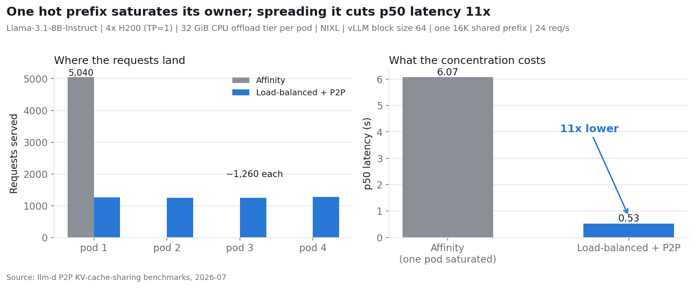
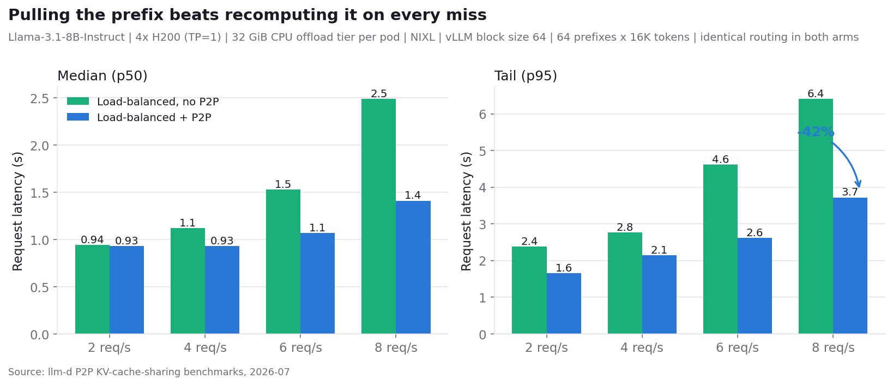
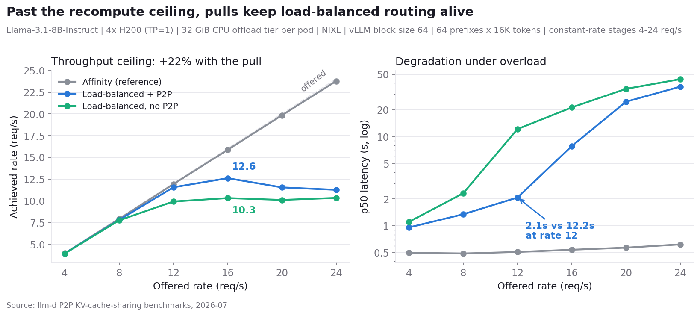
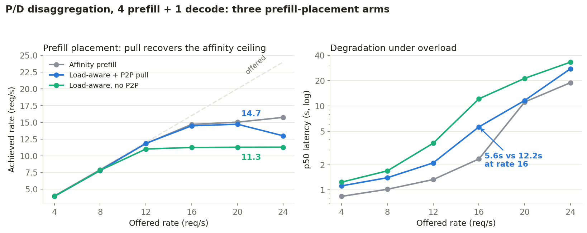

---
# DRAFT — feature not yet merged. Date, authors, tags, and all benchmark
# numbers are placeholders. Remove `draft: true` and this comment block
# before publishing.
title: "Peer-to-Peer KV Cache Sharing in llm-d"
description: "llm-d's P2P connector lets any vLLM instance pull cached prefix KV blocks directly from a peer's CPU cache instead of recomputing them - turning per-pod prefix caches into a fleet-wide cache without shared storage."
slug: p2p-kv-cache-sharing-llm-d
date: 2026-08-15T09:00
draft: true

authors:
  - niliguy
  - liranschour
  # TODO: third co-author TBD

tags: [blog, kv-cache]
# TODO: consider adding a dedicated p2p tag to tags.yml
---

# Peer-to-Peer KV Cache Sharing in llm-d

In a distributed llm-d deployment, every vLLM instance keeps its own prefix KV cache. Prefix-aware routing steers requests toward the pod most likely to hold their prefix, but affinity has limits: sessions move between pods under load balancing, new replicas come up cold after scale-out, and a popular shared prefix ends up recomputed once per pod that serves it. Each of those recomputations burns prefill compute on KV tensors that already exist somewhere in the cluster.

The P2P connector closes that gap. It makes every vLLM instance a peer that can pull cached prefix KV blocks directly from another peer's CPU cache over the network, instead of recomputing them. The llm-d Endpoint Picker (EPP) already scores each candidate pod's cached prefix blocks for every request; with P2P, that knowledge stops being just a ranking signal and becomes a transfer instruction: route the request to the best pod overall, and tell it where to fetch the prefix it is missing.

<!-- truncate -->

## The Gap: Prefix Caches Are Per-Pod

When the same prefix appears repeatedly - shared system prompts, common documents, agentic loops, multi-turn conversations - reusing the KV cache skips a large portion of prefill work, cutting time to first token (TTFT) and freeing GPU cycles for decode (a deeper dive on KV reuse use cases appears [here](https://llm-d.ai/blog/kvcache-wins-you-can-see)).

llm-d already attacks this problem from two directions:

* **Prefix-aware routing.** The EPP tracks which pods hold which prefix blocks (approximately, from routing history, or precisely, from KV events) and scores candidates accordingly, so requests land where their cache lives.
* **KV cache offloading.** vLLM's Offloading Connector spills KV blocks from GPU HBM to a much larger CPU memory tier, and llm-d's [filesystem backend](https://llm-d.ai/blog/native-kv-cache-offloading-to-any-file-system-with-llm-d) extends that to shared storage for cluster-wide reuse and persistence.

But routing alone cannot make a cold pod warm, and shared storage introduces an infrastructure dependency plus a storage-speed data path. There is a middle option: the blocks the request needs are often sitting in a peer pod's CPU offload tier, one network hop away, at memory speed. P2P KV cache sharing uses exactly that path.

## How P2P Works

The P2P connector generalizes the prefill/decode (P/D) disaggregation connector into a symmetric peer-to-peer mode. It reuses the same building blocks - CPU KV cache in a canonical layout, a NIXL data path, a ZMQ control path - but drops the hard prefiller/decoder role split. Every vLLM instance is a peer; for any given request a peer plays one of two roles:

* **Consumer**: pulls KV blocks for the request from a remote peer's CPU cache instead of computing them locally.
* **Producer**: serves KV blocks from its CPU cache when a remote consumer asks for them.

A single peer can be a consumer for some requests and a producer for others at the same time, over the same session.

The transfer itself is best-effort and asynchronous. The consumer sends the producer the block hashes it needs; the producer matches them against its local CPU cache and answers with the hits; the consumer allocates CPU slots for the hits and the producer pushes the blocks over NIXL. Hits load into the GPU as normal cache hits; misses are simply recomputed by the engine, so a partial or failed transfer degrades to today's behavior rather than failing the request.

{/* TODO: architecture figure - consumer/producer control + data path
   (ZMQ lookup/fetch, NIXL write), alongside the EPP header flow. */}

## How llm-d Decides When to Pull

llm-d's scheduler already estimates, for every request, how much of the prompt's prefix each candidate pod has cached - the same signal that powers prefix-aware routing. P2P adds one decision on top: it compares the best-cached pod against the pod that will actually compute the prefix, and when that peer holds enough more of the prefix to be worth a transfer, it marks the request - through a header the routing sidecar reads - to pull the missing blocks from that peer.

This is a small, opt-in scheduling step, off by default. Because it reuses the existing prefix-cache signal, it works with both prefix-aware routing modes and composes with P/D disaggregation: a prefill worker can pull a cached prefix from a peer, compute only the remainder, and still serve its own blocks to the decoder. Without disaggregation, the decode pod pulls the prefix directly. A tie or a self-match never triggers a pull - there is nothing to gain - and deployments that leave the feature off are unaffected.

## What This Enables

* **Session mobility without cache loss.** A multi-turn conversation rebalanced to a different pod pulls its history from the previous pod instead of recomputing it.
* **Fast warmup on scale-out.** A new replica serves cache hits from day zero by pulling hot shared prefixes from established peers.
* **Fleet-wide reuse of shared prefixes.** A long system prompt is prefilled once in the cluster, not once per pod.
* **No storage dependency.** Transfers go peer to peer at CPU-memory and network speed; no shared filesystem or object store is required. For deployments that want persistence and effectively unlimited capacity, P2P complements rather than replaces the storage tier.

## Benchmarks

We evaluated P2P KV cache sharing with the llm-d benchmarking framework
(inference-perf) on an aggregated deployment: 4x Llama-3.1-8B-Instruct, one
H200 each, KV transfers over NIXL/UCX (RDMA), a 32 GiB CPU offload tier per
pod, vLLM block size 64. Routing uses the llm-d inference gateway with the
precise (KV-event-fed) prefix index; the P2P arms add the
`kv-cache-source-producer` with a 2048-token minimum advantage threshold, so
a pull is only requested when a peer holds at least that many more cached
prefix tokens than the scheduled pod. {/* Setup: kermit/CoreWeave,
vLLM nightly + P2P connector branch + the lookup/pending-wait robustness
fixes; workload = inference-perf shared_prefix. */}

One deployment prerequisite applies to every P2P configuration: vLLM seeds its KV block hashes per process, so all peers must run with the same `PYTHONHASHSEED`. Without it, block hashes never match across pods and P2P silently degrades to zero matches - the protocol runs, but every lookup misses and every prefix is recomputed locally. The external prefix cache hit rate metric is the quickest way to catch this: it stays at zero.

### Pull versus recompute (single request)

Prefill latency for a fully cached prefix, recompute versus P2P pull from a
peer's CPU tier, warm mesh:

| prefix tokens | recompute | P2P pull | delta |
|---|---|---|---|
| 1,024 | 30 ms | 34 ms | +11% |
| 4,096 | 99 ms | 59 ms | -41% |
| 8,192 | 236 ms | 88 ms | -63% |
| 16,384 | 503 ms | 155 ms | -69% |

The crossover sits near 2K tokens and the advantage grows with prefix length
- at 16K the pull is 3.3x faster than recomputing. This is what motivates the
2048-token producer threshold.

*Single-request prefill latency, recompute versus P2P pull, warm mesh. The pull
costs a near-constant transfer while recompute grows with length; past ~2K
tokens the pull wins, 3.3x at 16K.*

### One hot prefix: routing is the win, P2P is the enabler

With a single hot 16K prefix ramped to 24 req/s, cache-affinity routing
concentrates all requests on the prefix owner and saturates it (p50 latency
6.1s at rate 24), while load-balanced routing keeps p50 at 0.53s - an 11x
tail-latency win. P2P adds nothing on top for a single persistent prefix
(each pod recomputes it once and it stays resident); its role in this regime
is to make load-balanced routing safe for prefixes that do not fit
everywhere, which the next scenario measures.

*One hot 16K prefix at 24 req/s. Affinity sends all 5,040 requests to the
prefix owner and saturates it; load-balanced routing spreads them evenly and
cuts p50 latency 11x.*

### Shared-prefix pool: P2P makes load-balancing viable

The headline workload: 64 distinct 16K-token system prompts (a 128 GiB KV
pool - far more than any single pod caches), 256-token questions, 64 output
tokens, constant-rate stages. Every request landing on a pod that does not
hold its prefix must recompute 16K tokens (no P2P) or pull them from the
holder (P2P). Same load-balanced routing in both arms; cache-affinity
routing as the reference (64 uniformly popular prefixes spread evenly, so
affinity balances well here - its best case).

At moderate rates (2-8 req/s), successful-request latency, no-P2P versus
P2P:

| rate | no-P2P p50 / p95 | P2P p50 / p95 | P2P TTFT p50 vs no-P2P |
|---|---|---|---|
| 2 req/s | 0.94s / 2.38s | 0.93s / 1.65s | 0.40s vs 0.57s |
| 4 req/s | 1.12s / 2.76s | 0.93s / 2.14s | 0.42s vs 0.57s |
| 6 req/s | 1.53s / 4.62s | 1.07s / 2.62s | 0.56s vs 0.59s |
| 8 req/s | 2.49s / 6.41s | 1.41s / 3.72s | 0.59s vs 0.79s |

P2P wins at every rate and the gap grows with load: at 8 req/s, 43% lower
p50 and 42% lower p95, with TTFT 25-30% lower - the prefix arrives over RDMA
instead of being recomputed.

*Successful-request latency on the pool workload, identical routing in both
arms. The only difference is pulling the 16K prefix versus recomputing it; the
gap widens as recompute pressure builds.*

At high rates the difference is structural. Without P2P, load-balanced
routing collapses on this pool: recompute demand saturates the fleet near 10
req/s aggregate, and p50 latency climbs to 44s at rate 24 (TTFT p50 37s).
Affinity routing stays flat (~0.5-0.6s p50) because this pool is its best
case. With P2P, load-balanced routing holds:

| offered rate | no-P2P achieved / p50 lat | P2P achieved / p50 lat |
|---|---|---|
| 12 req/s | 9.9 req/s / 12.2s | 11.6 req/s / 2.1s |
| 16 req/s | 10.3 req/s / 21.3s | 12.6 req/s / 7.8s |
| 20 req/s | 10.1 req/s / 34.3s | 11.6 req/s / 24.6s |
| 24 req/s | 10.4 req/s / 44.1s | 11.3 req/s / 36.4s |

P2P raises the saturation ceiling by ~22% (12.6 versus 10.3 req/s achieved)
and delivers up to 83% lower p50 in the 12-16 req/s band where no-P2P has
already collapsed but P2P still keeps pace, with 30% higher peak token
throughput (3,184 versus 2,420 tok/s). Both arms eventually saturate - the
GPUs run out either way - but the pull path buys the fleet a fifth of extra
capacity and a far gentler degradation curve on a workload whose working set
no single pod can cache.

*Left: achieved versus offered rate. Affinity tracks the offered line (its
best-case pool); recompute saturates near 10 req/s; P2P holds ~12.6. Right:
median latency on a log scale - the band between the recompute and P2P curves
is the pull's value under overload.*

### Prefill placement under P/D

The same question under P/D disaggregation: 4 prefill + 1 decode
Llama-3.1-8B, NIXL carrying KV between the legs, same pool workload, three
prefill-placement arms that differ only in how the prefill worker is chosen.
Prefix-affinity placement saturates at ~15.7 req/s - on this topology the
single decode pod's KV intake, not prefill placement, is the ceiling.
Load-aware placement without P2P saturates at ~11.3 req/s: every cross-pod
prefill recomputes 16K tokens, and p50 latency reaches 33s. Adding the P2P
pull recovers the affinity ceiling: ~14.7 req/s, +30% over recompute, with
p50 5.6s versus 12.2s at 16 req/s. The pull is what makes load-aware prefill
placement viable under P/D, at a 0.2-0.5s TTFT premium at low rates where
affinity's pure cache hits win. Zero failures and zero restarts across all
three arms (15,123 requests).

*Three prefill-placement strategies on the P/D topology. Without the pull,
load-aware placement is recompute-bound at 11.3 req/s; with it, throughput
returns to the decode-bound affinity ceiling.*

### Future scenarios

* **Prefill placement under skew.** The pool above is uniformly popular -
  affinity's best case. Under a skewed prefix distribution affinity
  concentrates prefill on the hot prefix's owner; load-aware placement plus
  the pull should win latency as well as balance. Measures per-worker
  prefill load balance and p99 TTFT.
* **Session handoff.** Multi-turn conversations with forced pod switches mid-session; measures TTFT for the first turn after a switch, where P2P should convert a full-prefix recompute into a pull.
* **Scale-out warmup.** Add a cold replica under steady shared-prefix load; measure its TTFT and external prefix cache hit rate over time versus baseline.

## Summary and Next Steps

P2P KV cache sharing turns llm-d's per-pod prefix caches into a fleet-wide resource. The EPP's existing per-request prefix knowledge picks the source, a single header carries the decision, and the connector moves the blocks peer to peer - best-effort, asynchronous, and off the request's failure path. It composes with prefix-aware routing (which minimizes how often a pull is needed), with P/D disaggregation (prefill workers pull prefixes too), and with the storage tier (which adds persistence and capacity beyond what peers hold).

The natural follow-up is agentic workloads. In real Claude Code traces (the [Weka trace corpus](https://www.semianalysis.com/) published by SemiAnalysis), over half of all model requests arrive through sub-agent bursts - a median of seven per group, 51 at p90 - each inheriting the parent session's context as a verbatim prefix, with no advance signal to the serving layer. A burst that spills across pods today recomputes that repository-scale prefix once per pod; with P2P, the pod that already holds it computes nothing and everyone else pulls. A follow-up post will replay these traces (inference-perf's `weka_trace_replay`) against a P2P-enabled deployment to measure exactly that - sub-agent fan-out, session handoff, and think-time gaps included. {/* TODO: fix the corpus link to the exact trace release, and link the agentic-serving GLM post once published */}

The work is tracked in llm-d-router [#1574](https://github.com/llm-d/llm-d-router/issues/1574) (P2P connector design) and [#1923](https://github.com/llm-d/llm-d-router/issues/1923) (EPP source selection). {/* TODO: link the well-lit-path guide and the vLLM offloading-connector pieces once merged; update status wording at publish time. */}
