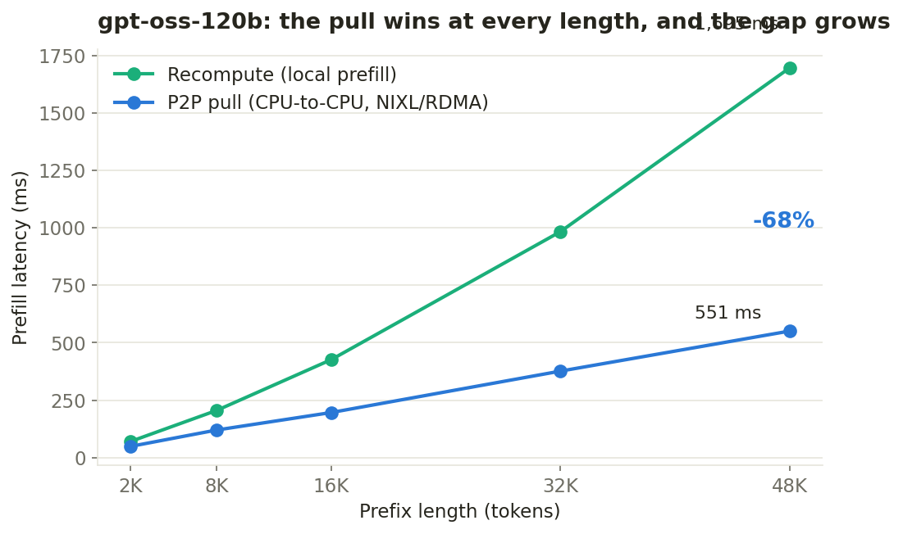
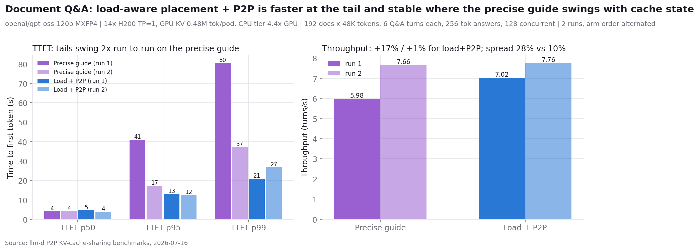
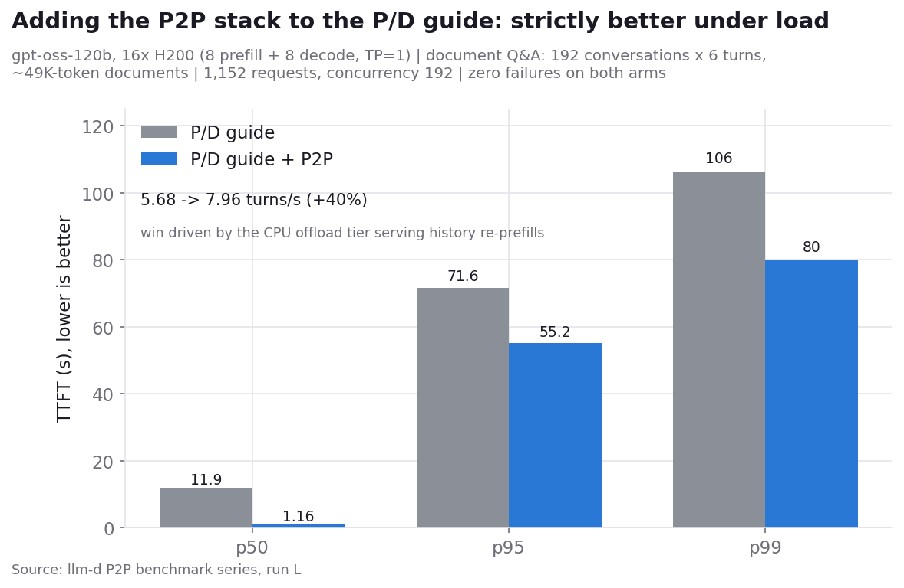
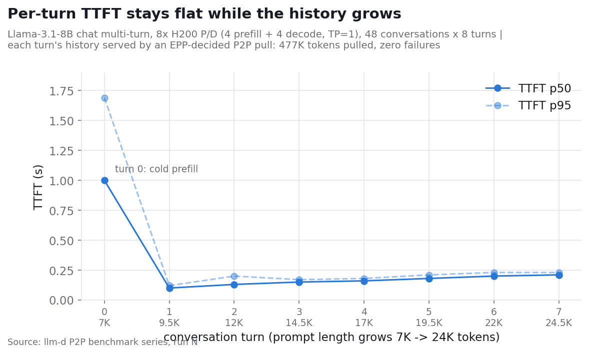
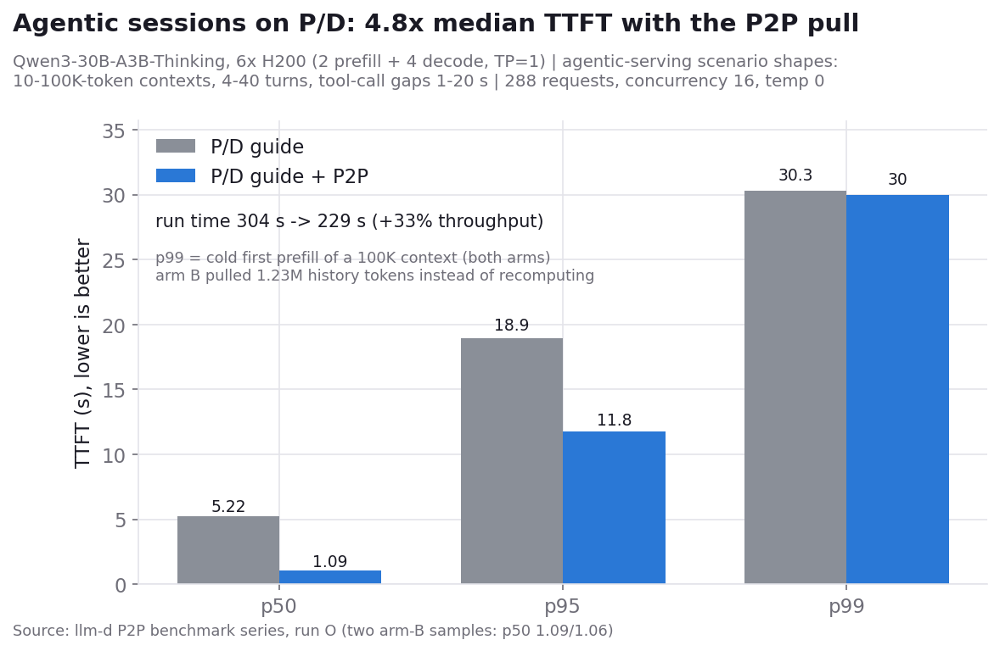

---
# DRAFT — feature not yet merged. Date, authors, tags, and all benchmark
# numbers are placeholders. Remove `draft: true` and this comment block
# before publishing.
title: "Peer-to-Peer KV Cache Sharing in llm-d"
description: "llm-d's P2P connector lets any vLLM instance pull cached prefix KV blocks directly from a peer's CPU cache instead of recomputing them - turning per-pod prefix caches into a fleet-wide cache without shared storage."
slug: p2p-kv-cache-sharing-llm-d
date: 2026-08-15T09:00
draft: true

authors:
  - niliguy
  - liranschour
  # TODO: third co-author TBD

tags: [blog, kv-cache]
# TODO: consider adding a dedicated p2p tag to tags.yml
---

# Peer-to-Peer KV Cache Sharing in llm-d

In a distributed llm-d deployment, every vLLM instance keeps its own prefix KV cache. Prefix-aware routing steers requests toward the pod most likely to hold their prefix, but affinity has limits: sessions move between pods under load balancing, new replicas come up cold after scale-out, and a popular shared prefix ends up recomputed once per pod that serves it. Each of those recomputations burns prefill compute on KV tensors that already exist somewhere in the cluster.

The P2P connector closes that gap. It makes every vLLM instance a peer that can pull cached prefix KV blocks directly from another peer's CPU cache over the network, instead of recomputing them. The llm-d Endpoint Picker (EPP) already scores each candidate pod's cached prefix blocks for every request; with P2P, that knowledge stops being just a ranking signal and becomes a transfer instruction: route the request to the best pod overall, and tell it where to fetch the prefix it is missing.

<!-- truncate -->

## The Gap: Prefix Caches Are Per-Pod

When the same prefix appears repeatedly - shared system prompts, common documents, agentic loops, multi-turn conversations - reusing the KV cache skips a large portion of prefill work, cutting time to first token (TTFT) and freeing GPU cycles for decode (a deeper dive on KV reuse use cases appears [here](https://llm-d.ai/blog/kvcache-wins-you-can-see)).

llm-d already attacks this problem from two directions:

* **Prefix-aware routing.** The EPP tracks which pods hold which prefix blocks (approximately, from routing history, or precisely, from KV events) and scores candidates accordingly, so requests land where their cache lives.
* **KV cache offloading.** vLLM's Offloading Connector spills KV blocks from GPU HBM to a much larger CPU memory tier, and llm-d's [filesystem backend](https://llm-d.ai/blog/native-kv-cache-offloading-to-any-file-system-with-llm-d) extends that to shared storage for cluster-wide reuse and persistence.

But routing alone cannot make a cold pod warm, and shared storage introduces an infrastructure dependency plus a storage-speed data path. There is a middle option: the blocks the request needs are often sitting in a peer pod's CPU offload tier, one network hop away, at memory speed. P2P KV cache sharing uses that path.

## How P2P Works

The P2P connector generalizes the prefill/decode (P/D) disaggregation connector into a symmetric peer-to-peer mode. It reuses the same building blocks - CPU KV cache in a canonical layout, a NIXL (NVIDIA's inference transfer library) data path for the block movement, a ZMQ message-queue control path for the lookup handshake - but drops the hard prefiller/decoder role split. Every vLLM instance is a peer; for any given request a peer plays one of two roles:

* **Consumer**: pulls KV blocks for the request from a remote peer's CPU cache instead of computing them locally.
* **Producer**: serves KV blocks from its CPU cache when a remote consumer asks for them.

A single peer can be a consumer for some requests and a producer for others at the same time, over the same session.

The transfer itself is best-effort and asynchronous. The consumer sends the producer the block hashes it needs; the producer matches them against its local CPU cache and answers with the hits; the consumer allocates CPU slots for the hits and the producer pushes the blocks over NIXL. Hits load into the GPU as normal cache hits; misses are recomputed by the engine, so a partial or failed transfer degrades to today's behavior rather than failing the request.

*The EPP selects both the destination pod and the source peer, and passes the decision to the consumer as a header. The routing sidecar injects the transfer params into the request; the consumer's offloading connector then opens a peer session and does the work engine to engine - a ZMQ control exchange settles which blocks the peer holds, and NIXL moves those blocks CPU-tier to CPU-tier (neither GPU is touched). Hits load into the consumer's GPU as normal cache hits, and any unmatched blocks recompute, so a partial or failed transfer degrades to today's behavior.*

## How llm-d Decides When to Pull

llm-d's scheduler already estimates, for every request, how much of the prompt's prefix each candidate pod has cached - the same signal that powers prefix-aware routing. P2P adds one decision on top: it compares the best-cached pod against the pod that will actually compute the prefix, and when that peer holds enough more of the prefix to be worth a transfer, it marks the request - through a header the routing sidecar reads - to pull the missing blocks from that peer.

This is a small, opt-in scheduling step, off by default. Because it reuses the existing prefix-cache signal, it works with both prefix-aware routing modes and composes with P/D disaggregation: a prefill worker can pull a cached prefix from a peer, compute only the remainder, and still serve its own blocks to the decoder. Without disaggregation, the decode pod pulls the prefix directly. A tie or a self-match never triggers a pull - there is nothing to gain - and deployments that leave the feature off are unaffected.

## What This Enables

* **Session mobility without cache loss.** A multi-turn conversation rebalanced to a different pod pulls its history from the previous pod instead of recomputing it.
* **Fast warmup on scale-out.** A new replica serves cache hits from day zero by pulling hot shared prefixes from established peers.
* **Fleet-wide reuse of shared prefixes.** A long system prompt is prefilled once in the cluster, not once per pod.
* **No storage dependency.** Transfers go peer to peer at CPU-memory and network speed; no shared filesystem or object store is required. For deployments that want persistence and effectively unlimited capacity, P2P complements rather than replaces the storage tier.

## Benchmarks

We evaluated P2P KV cache sharing with the llm-d benchmarking framework
(inference-perf) on two aggregated testbeds, and then on P/D-disaggregated
topologies (each described with its measurement below):

* **Scale:** 14x `openai/gpt-oss-120b` (MXFP4), one H200 per pod (TP=1),
  ~0.48M tokens of GPU KV per pod, an 88 GiB CPU offload tier per pod
  (4.4x the GPU cache), vLLM block size 64.
* **Small model:** 4x Llama-3.1-8B-Instruct, one H200 each, a 32 GiB CPU
  offload tier per pod - the same mechanics at a size anyone can rerun on
  four GPUs.

KV transfers go over NIXL - the transport abstraction, running on the
testbed's RDMA-capable network here; latencies depend on the underlying
fabric - and routing uses the llm-d inference gateway
with the precise (KV-event-fed) prefix index. The P2P arms add the
`p2p-source-producer` with a 2048-token minimum advantage threshold, so a
pull is only requested when a peer holds at least that many more cached
prefix tokens than the scheduled pod. The exact workload profiles and EPP
configurations for every run ship with the guide, so each result below is
reproducible the same way the other llm-d guides' benchmarks are.
{/* Setup: kermit/CoreWeave, vLLM nightly + P2P connector branch +
robustness fixes; full tables in the p2p-findings RESULTS.md. */}

Two deployment prerequisites apply to every P2P configuration. First,
block hashes must agree across the fleet: vLLM seeds them per process, so
all peers need the same `PYTHONHASHSEED` and an identical `--block-size`.
Without either, hashes never match across pods and P2P silently degrades
to zero matches - the protocol runs, but every lookup misses and every
prefix is recomputed locally. The external prefix cache hit rate metric is
the quickest way to catch this: it stays at zero. Second, the CPU offload
tier peers serve from must be considerably larger than the pod's GPU KV
cache (we run 2x) - its value is the KV that GPU evicts and CPU retains.
Compute that ratio from the engine's reported KV capacity rather than
per-GPU intuition: weights are paid once per pod while KV memory scales
with the tensor-parallel degree, so a tier that doubles the GPU cache at
TP=1 can be a fraction of it at TP=4.

### Pull versus recompute (single request)

The physics everything else builds on: prefill latency for a fully cached
prefix, recompute versus P2P pull from a peer's CPU tier. gpt-oss-120b,
fresh prefix seeded on one pod, measured on a cold pod, 5-rep medians:

| prefix tokens | recompute | P2P pull | delta |
|---|---|---|---|
| 2,048 | 71 ms | 49 ms | -31% |
| 8,192 | 205 ms | 120 ms | -42% |
| 16,384 | 426 ms | 196 ms | -54% |
| 32,768 | 983 ms | 376 ms | -62% |
| 49,152 | 1,695 ms | 551 ms | -68% |

The pull wins at every measured length and the gap grows with the prefix:
at 48K - a large document - the pull delivers the prefix 3x faster than
gpt-oss's fast MoE prefill (~29K tokens/s) can recompute it. The
measurement is a single source-consumer pod pair, so it is independent of
fleet size. The small-model testbed shows the same scaling: on Llama-8B
the lines cross near 2K tokens (below it recompute wins, +11% at 1K) and
the pull leads -69% at 16K; on gpt-oss the pull already wins at 2K because
its KV is compact (41.5 KB/token) relative to its prefill speed. Where the
lines cross depends on the model's KV-size-to-prefill-speed ratio; the
economics are a property of the mechanism. The router's 2048-token pull
threshold - the minimum extra cached-prefix tokens a peer must hold beyond
the scheduled pod before a pull is requested - is set to the smallest
length at which the pull wins on both models.

*Single-request prefill latency, recompute versus P2P pull, gpt-oss-120b.
the pull's latency grows far slower than recompute's as the prefix
lengthens; the gap reaches -68% at 48K tokens.*

### Document Q&A at scale: the headline result

The workload where the pull changes what users feel: 192 distinct
48K-token documents (about 100 pages each), each queried through 6 short
questions with 256-token answers, 128 conversations in flight - the
enterprise document-assistant shape, where time to first token dominates
the experience. The working set oversubscribes the fleet's GPU cache, so
request placement decides whether a document is a cache hit, a recompute,
or a wait in line.

Two arms: the precise prefix-cache routing configuration (prefix-first
placement), and load-aware placement with the P2P pull. Two full runs with
arm order alternated; all four runs completed 1,152/1,152 turns with zero
errors and zero restarts. TTFT p50 / p95 / p99 in seconds, and throughput:

| Configuration | run | TTFT p50 | TTFT p95 | TTFT p99 | Throughput |
|---|---|---|---|---|---|
| Precise prefix routing | 1 | 4.1s | 41.0s | 80.5s | 5.98 turns/s |
| Precise prefix routing | 2 (order reversed) | 4.2s | 17.3s | 37.2s | 7.66 turns/s |
| Load-aware + P2P | 1 | 4.5s | 13.0s | 20.9s | 7.02 turns/s |
| Load-aware + P2P | 2 (order reversed) | 3.9s | 12.5s | 26.7s | 7.76 turns/s |

*192 documents x 48K tokens, 6 Q&A turns each, 128 concurrent. Medians are
equal; the arms separate on tails and on stability.*

Medians are equal - a session answering from its warm cache is fast either
way. The separation is in the tails and the variance: **p99 TTFT of 21-27s
with P2P versus 37-81s with prefix-first routing - a 28-74% reduction, up
to 3.9x lower - alongside up to +17% throughput and a 10% run-to-run spread
versus 28%**. The mechanism: prefix-first placement sends every
question to the pod that owns its document, and under contention the queue
on that pod becomes the p99 - while displaced questions recompute 48K
tokens. Load-aware placement sends the question wherever there is
capacity, and the pull makes the resulting miss cost ~0.6s instead of a
~2s recompute or a multi-second wait. The tier counters agree: the P2P arm
moved 30-32M tokens between pods per run.

The consistency across the two runs matters as much as the speed: the
prefix-first arm's numbers swing with whatever cache state the fleet
happens to inherit (the two runs deliberately alternate arm order, so each
arm serves once from a cold fleet and once from one warmed by the other
arm), while load-aware + P2P placement does not depend on where KV already
lives - so its results moved little between these two runs. A stronger
stability claim would want more repetitions; this is the behavior observed
across the alternated pair.

The remaining scenarios run on the small-model testbed (4x Llama-3.1-8B) -
the same mechanics at a scale that reruns on four GPUs.

### One hot prefix: routing is the win, P2P is the enabler

With a single hot 16K prefix ramped to 24 req/s, cache-affinity routing
concentrates all requests on the prefix owner and saturates it (p50 latency
6.1s at rate 24), while load-balanced routing keeps p50 at 0.53s - an 11x
lower median latency. P2P adds nothing on top for a single persistent prefix
(each pod recomputes it once and it stays resident); its role in this regime
is to make load-balanced routing safe for prefixes that do not fit
everywhere - the next scenario measures that at small scale, and the
document Q&A benchmark above is the same effect at fleet scale.

*One hot 16K prefix at 24 req/s. Affinity sends all 5,040 requests to the
prefix owner and saturates it; load-balanced routing spreads them evenly and
cuts p50 latency 11x.*

### Shared-prefix pool: P2P makes load-balancing viable

A shared-prefix pool: 64 distinct 16K-token system prompts (a 128 GiB KV
pool - far more than any single pod caches), 256-token questions, 64 output
tokens, constant-rate stages. Every request landing on a pod that does not
hold its prefix must recompute 16K tokens (no P2P) or pull them from the
holder (P2P). Same load-balanced routing in both arms; cache-affinity
routing as the reference (64 uniformly popular prefixes spread evenly, so
affinity balances well here - its best case).

At moderate rates (2-8 req/s), successful-request latency, no-P2P versus
P2P:

| rate | no-P2P p50 / p95 | P2P p50 / p95 | P2P TTFT p50 vs no-P2P |
|---|---|---|---|
| 2 req/s | 0.94s / 2.38s | 0.93s / 1.65s | 0.40s vs 0.57s |
| 4 req/s | 1.12s / 2.76s | 0.93s / 2.14s | 0.42s vs 0.57s |
| 6 req/s | 1.53s / 4.62s | 1.07s / 2.62s | 0.56s vs 0.59s |
| 8 req/s | 2.49s / 6.41s | 1.41s / 3.72s | 0.59s vs 0.79s |

P2P wins at every rate and the gap grows with load: at 8 req/s, 43% lower
p50 and 42% lower p95, with TTFT 5-30% lower across the measured rates
(25% at 8 req/s) - the prefix arrives over the network instead of being
recomputed.

*Successful-request latency on the pool workload, identical routing in both
arms. The only difference is pulling the 16K prefix versus recomputing it; the
gap widens as recompute pressure builds.*

At high rates the difference is structural. Without P2P, load-balanced
routing collapses on this pool: recompute demand saturates the fleet near 10
req/s aggregate, and p50 latency climbs to 44s at rate 24 (TTFT p50 37s).
Affinity routing stays flat (~0.5-0.6s p50) because this pool is its best
case. With P2P, load-balanced routing holds:

| offered rate | no-P2P achieved / p50 lat | P2P achieved / p50 lat |
|---|---|---|
| 12 req/s | 9.9 req/s / 12.2s | 11.6 req/s / 2.1s |
| 16 req/s | 10.3 req/s / 21.3s | 12.6 req/s / 7.8s |
| 20 req/s | 10.1 req/s / 34.3s | 11.6 req/s / 24.6s |
| 24 req/s | 10.4 req/s / 44.1s | 11.3 req/s / 36.4s |

P2P raises the saturation ceiling by ~22% (12.6 versus 10.3 req/s achieved)
and delivers up to 83% lower p50 in the 12-16 req/s band where no-P2P has
already collapsed but P2P still keeps pace, with 30% higher peak token
throughput (3,184 versus 2,420 tok/s). Both arms eventually saturate - the
GPUs run out either way - but the pull path buys the fleet a fifth of extra
capacity and a far gentler degradation curve on a workload whose working set
no single pod can cache.

*Left: achieved versus offered rate. Affinity tracks the offered line (its
best-case pool); recompute saturates near 10 req/s; P2P holds ~12.6. Right:
median latency on a log scale - the band between the recompute and P2P curves
is the pull's value under overload.*

### P/D disaggregation: adding the stack is strictly better

Under P/D disaggregation the pull applies to the **prefill leg only**: the
prefill worker computes the prompt's KV and streams it to the decoder, so
that is the leg where recomputing a cached prefix is wasted work. The EPP
sets the KV-cache-source header against the prefill target, and the sidecar
injects `kv_transfer_params.p2p` onto the prefill leg (the decode leg
already receives the full KV over NIXL and has nothing to pull). A prefill
worker placed off the prefix owner therefore pulls the cached prefix from a
peer and computes only the remainder.

The first measurement is the composability check: the
[pd-disaggregation guide](https://github.com/llm-d/llm-d/tree/main/guides/pd-disaggregation)
exactly as shipped, versus the same deployment plus the P2P stack
(offload tier + pull), and nothing else changed. gpt-oss-120b on 16x H200
(8 prefill + 8 decode, TP=1), the document-Q&A workload at concurrency
192, both arms completing 1,152 of 1,152 requests:

| | P/D guide | P/D guide + P2P |
|---|---|---|
| TTFT p50 | 11.94 s | **1.16 s** |
| TTFT p95 | 71.6 s | 55.2 s |
| TTFT p99 | 106.1 s | **80.0 s** |
| throughput | 5.68 turns/s | **7.96 turns/s** |

*The guide with and without the P2P stack, same day, fresh fleet per arm.*

At this operating point the win comes from the stack's CPU offload tier:
turn N+1's history re-prefill is served from cache (52M externally served
tokens in the run) instead of recomputed under 192-deep queues. The pull
itself stays quiet under the guide's prefix-affine placement and activates
when placement diverges - which the next two measurements exercise
directly.

### The prefiller pulls from the decoder

In a multi-turn conversation the newest KV lives on the decode worker: it
received the prompt over NIXL and generated the answer. When the next turn
arrives, the scheduled prefill worker is missing that history, the
EPP's index (fed by both roles' cache events) sees the decoder holding it,
and the pull fires - per turn, decided by the router, no application
change.

Measured on Llama-3.1-8B chat multi-turn (4 prefill + 4 decode, 48
conversations x 8 turns): 477K tokens of session history moved
decoder-to-prefiller in one run, and per-turn TTFT holds at 0.1-0.2 s
while prompts grow from 7K to 24K tokens. At 2 prefill workers and
concurrency 96 the same run pulls 1.65M tokens. On a model this small the
recompute it replaces is also cheap, so the benefit is prefill capacity
rather than visible latency - the sizing signal for where the pull pays:
the larger the history and the slower the model's prefill, the larger the
win.

*Turn 0 pays the cold prefill; every later turn's history arrives by pull.*

### Agentic sessions: where the pull pays most

Agentic serving concentrates everything the pull is for: contexts of
10-100K tokens, sessions of many turns, and tool-call gaps during which a
session's KV is evicted from GPU memory - so re-engagement is exactly the
pull-versus-recompute choice. The
[agentic-serving guide's](https://github.com/llm-d/llm-d/tree/main/guides/agentic-serving)
benchmark shapes (its model, block size, and generation settings; contexts
10-100K tokens, 4-40 turns, tool-call gaps of 1-20 s), served on the P/D
topology: Qwen3-30B-A3B-Thinking on 6x H200 (2 prefill + 4 decode, TP=1),
288 requests at concurrency 16, both arms 288 of 288, fresh fleet per arm:

| | P/D guide | P/D guide + P2P |
|---|---|---|
| TTFT p50 | 5.22 s | **1.09 s** |
| TTFT p95 | 18.94 s | **11.77 s** |
| TTFT p99 | 30.29 s | 29.98 s |
| run time | 304 s | **229 s** |

*A second arm-B sample reproduced the result (p50 1.06 s, 237 s).*

4.8x median TTFT and +33% throughput, with 1.23M tokens of session history
pulled instead of recomputed in the 229-second run. The p99 is unchanged
by design: both arms' worst case is the cold first prefill of a
100K-token context, and the pull removes *re*-computation, not the first
computation. Two deviations from the scenario, applied to both arms:
prefix caching is enabled (the scenario disables it; reuse is the subject
here), and the topology is P/D (the scenario deploys two aggregated
pods).

### When pulling pays: calibrating the threshold

The `minCachedTokenDelta` threshold from the scheduling step above is a
crossover, and it is measurable per model in minutes on a live pod pair:
time a warm pull of N tokens against a fresh recompute of N tokens at two
sizes, and the fixed pull overhead and per-token rates fall out. Measured
on H200:

| model | pull 8K tokens | recompute 8K tokens | crossover | threshold |
|---|---|---|---|---|
| Qwen3-30B-A3B | 74 ms | 1.21 s | ~760 tokens | 1024 |
| Llama-3.1-8B | ~100 ms | ~300 ms | ~900 tokens | 1024 |
| gpt-oss-120b | ~100 ms | ~3.3 s | ~300 tokens | 2048 |

Above the crossover the pull wins and the gap widens with size - 16x at
8K tokens on Qwen3-30B, and agentic histories run 10-100K. Below it,
recomputing is cheaper than the transfer's fixed cost, and the threshold
keeps the scheduler from ever issuing a losing pull. Sizing the tier that
serves the pulls follows the same measure-first rule: read the engine's
KV capacity from its startup log and provision the CPU tier at about
twice that (the value of the tier is the KV that GPU evicts and CPU
retains), with `/dev/shm` above the tier size and the pod memory limit
above both.

Two boundaries define where these numbers apply. Pulling a *generated*
turn requires the next request to reproduce the same token IDs, which
chat-templated APIs do for models whose templates re-render assistant
turns verbatim (the Llama measurement above); models that drop reasoning
segments on re-render (gpt-oss, Qwen3-Thinking) expose only their input
context and re-prefilled history for pulling - still the bulk of agentic
reuse. And peers must run the same tensor-parallel degree: KV block
identity is TP-dependent in the connector, so the P/D topologies here run
prefill and decode at matched TP.

### Future scenarios

* **Prefill placement under skew.** The pool above is uniformly popular -
  affinity's best case. Under a skewed prefix distribution affinity
  concentrates prefill on the hot prefix's owner; load-aware placement plus
  the pull should win latency as well as balance. Measures per-worker
  prefill load balance and p99 TTFT.
* **Scale-out warmup.** Add a cold replica under steady shared-prefix load; measure its TTFT and external prefix cache hit rate over time versus baseline.

## Summary and Next Steps

P2P KV cache sharing turns llm-d's per-pod prefix caches into a fleet-wide resource. The EPP's existing per-request prefix knowledge picks the source, a single header carries the decision, and the connector moves the blocks peer to peer - best-effort, asynchronous, and off the request's failure path. It composes with prefix-aware routing (which minimizes how often a pull is needed), with P/D disaggregation (prefill workers pull prefixes too), and with the storage tier (which adds persistence and capacity beyond what peers hold).

The measurements give a simple rule for when to reach for it. When the
working set fits in the fleet's GPU caches, prefix-aware routing alone is
the right tool - a local hit is free and nothing beats it. When long
prefixes oversubscribe the cache - large documents, deep sessions, wide
prefix pools - placement by cache location starts paying in queues and
recomputes, and that is where load-aware placement plus the pull wins.
The crossover measurement prices each miss; the document-Q&A benchmark
above shows what that pricing compounds into at fleet scale, on the tail
latencies users actually feel.

The agentic measurement above uses the guide's synthetic session shapes; the follow-up is real traces. In recorded Claude Code sessions (the [Weka trace corpus](https://www.semianalysis.com/) published by SemiAnalysis), over half of all model requests arrive through sub-agent bursts - a median of seven per group, 51 at p90 - each inheriting the parent session's context as a verbatim prefix, with no advance signal to the serving layer. A burst that spills across pods today recomputes that repository-scale prefix once per pod; with P2P, the pod that already holds the prefix becomes the source while the others pull the cached blocks instead of recomputing them. A follow-up post will replay these traces (inference-perf's `weka_trace_replay`) against a P2P-enabled deployment to measure that directly - sub-agent fan-out, session handoff, and think-time gaps included. {/* TODO: fix the corpus link to the exact trace release, and link the agentic-serving GLM post once published */}
